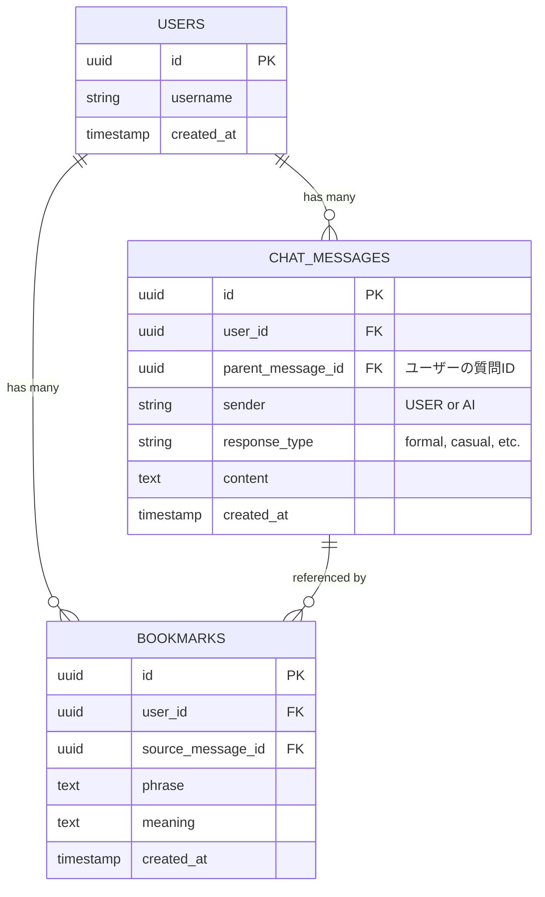

# 英語学習チャットシステム DB設計書

## 1. 概要
本ドキュメントは「英語学習チャットシステム」の要件定義書に基づいたデータベース設計（論理設計・物理設計案）を記述する。

## 2. ER図 (概念図)

---

## 3. テーブル定義

### 3.1 Users (ユーザー / Profiles)
Supabase Auth (`auth.users`) と連携し、ユーザーのプロフィール情報を管理するテーブル。
Supabaseの認証ユーザーと1対1で紐付く。

| 論理名 | 物理名 | 型 | 制約 | 説明 |
| --- | --- | --- | --- | --- |
| ユーザーID | `id` | UUID | PK, FK | `auth.users.id` を参照。認証ユーザーと同一IDを持つ |
| ユーザー名 | `username` | VARCHAR(255) | NULL | 表示用ユーザー名 |
| 作成日時 | `created_at` | TIMESTAMP | DEFAULT NOW() | - |

> **実装Memo (Supabase):**
> * 新規登録時、`auth.users` への追加をトリガー(Postgres Trigger)として、このテーブルにも自動的にレコードを作成する運用が一般的です。
> * メールアドレス等は `auth.users` 側で管理されるため、ここでは持たなくて良い設計とします。

### 3.2 ChatMessages (チャット履歴)
チャットの送受信履歴を管理するテーブル。
**「1つの問いに3つの答え」**という要件に対応するため、AIからの回答には `response_type` を付与し、かつ `parent_message_id` でユーザーの質問と紐付ける構造とする。

| 論理名 | 物理名 | 型 | 制約 | 説明 |
| --- | --- | --- | --- | --- |
| メッセージID | `id` | UUID | PK | メッセージを一意に識別するID |
| ユーザーID | `user_id` | UUID | FK(Users) | メッセージの所有者 |
| 親メッセージID | `parent_message_id` | UUID | FK(ChatMessages) | AI回答の場合、トリガーとなったユーザーメッセージのIDを入れる (NULL可) |
| 送信者 | `sender` | VARCHAR(10) | NOT NULL | `'USER'` または `'AI'` |
| コンテンツ | `content` | TEXT | NOT NULL | メッセージ本文（英語フレーズ等） |
| 回答タイプ | `response_type` | VARCHAR(50) | NULL | AI回答の属性 (例: `'formal'`, `'casual'`, `'native'`)。 ユーザー送信時はNULL。 |
| 作成日時 | `created_at` | TIMESTAMP | DEFAULT NOW() | 送信日時 |

**補足:**
* ユーザーが発言した場合: `sender`='USER', `parent_message_id`=NULL
* AIが3連投する場合: 3レコード作成される。全て `sender`='AI', `parent_message_id`=（直前のユーザー発言ID） となる。

### 3.3 Bookmarks (ブックマーク)
ユーザーが保存したフレーズを管理するテーブル。

| 論理名 | 物理名 | 型 | 制約 | 説明 |
| --- | --- | --- | --- | --- |
| ブックマークID | `id` | UUID | PK | ブックマークを一意に識別するID |
| ユーザーID | `user_id` | UUID | FK(Users) | 所有ユーザーID |
| 元メッセージID | `source_message_id` | UUID | FK(ChatMessages) | ブックマーク元のメッセージID (NULL可: 削除されたメッセージの場合等を考慮) |
| フレーズ | `phrase` | TEXT | NOT NULL | 保存された英語フレーズ |
| 意味・解説 | `meaning` | TEXT | NULL | フレーズの日本語訳や解説（※要件4.3に基づく） |
| 作成日時 | `created_at` | TIMESTAMP | DEFAULT NOW() | 保存日時 |

---

## 4. 補足事項

### インデックス設計案
検索パフォーマンス向上のため、以下のインデックス推奨。

* **ChatMessages**:
    * `user_id`, `created_at` (履歴表示用)
    * `parent_message_id` (会話のスレッド表示用)
* **Bookmarks**:
    * `user_id`, `created_at` (一覧表示用)

### データフローイメージ
1. **ユーザー入力**: `ChatMessages` に `sender`='USER' でINSERT。
2. **AI生成**: 3パターンのテキストを生成。
3. **AI回答保存**: `ChatMessages` に `sender`='AI' で3レコードをINSERT。
    * それぞれ `response_type` に 'formal', 'casual' 等を記録。
    * `parent_message_id` に 1.のIDを記録。
4. **ブックマーク**: ユーザーが気に入ったフレーズの `message_id` とテキストを `Bookmarks` にINSERT。

---

## 5. アーキテクチャ・実装方針 (Next.js + Server Actions)

Next.js App Router と Server Actions を活用し、セキュアかつ効率的なデータアクセスを行う。

### 5.1 データアクセス層の考え方
Supabaseへの直接アクセスは極力サーバーサイドで行う。

* **Server Components (データ取得):**
    * ページの初期表示に必要なデータ（チャット履歴、ブックマーク一覧）は、Server Component内で `createServerComponentClient` を使用して取得する。
    * これにより、ユーザーの認証クッキーを安全に処理し、かつ高速な初期描画が可能。

* **Server Actions (データ更新):**
    * メッセージ送信、ブックマーク登録/削除などの更新処理は、`app/actions/` 等に定義した Server Actions として実装する。
    * Client Component（フォームやボタン）からこれらのActionを直接呼び出す。
    * Action内で `createServerActionClient` を使用し、認証チェックとDB操作を行う。
    * 処理完了後、`revalidatePath` を呼び出して表示データを更新する。

### 5.2 RLS (Row Level Security) の設定
Supabase側でRLSを有効化し、以下のポリシーを適用することで、Server Actions経由でも安全性を担保する。

* **全テーブル共通:**
    * `SELECT`, `INSERT`, `UPDATE`, `DELETE` は `auth.uid() = user_id` であるレコードのみ許可する。
    * これにより、バックエンド（Server Actions）で特別なチェックコードを書かなくても、DBレベルで他人のデータへのアクセスを防ぐことができる。

### 5.3 型安全性 (TypeScript)
* Supabase CLIを使用してデータベーススキーマから型定義ファイルを自動生成する (`database.types.ts`)。
* Server Actions および Components 内では、この型定義を使用して型安全な開発を行う。
